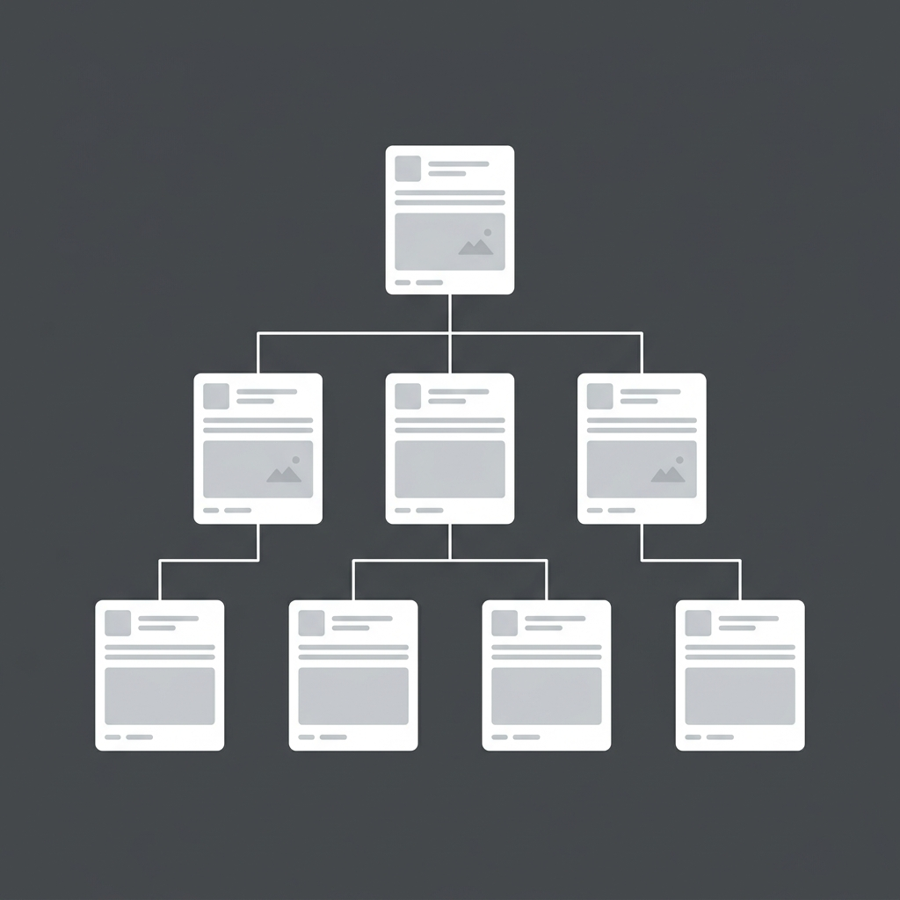
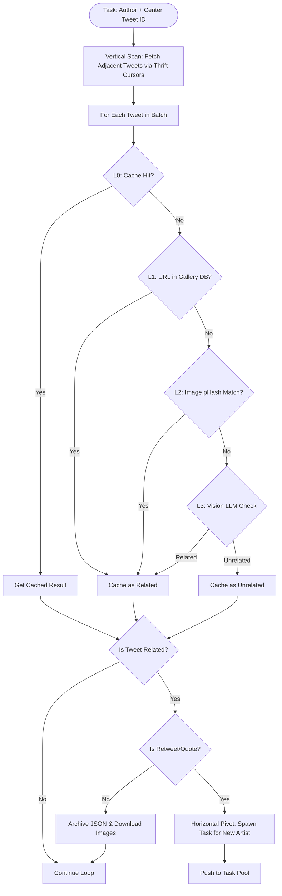

# Z-ArtDigger

<p align="center">
  
</p>

**Z-ArtDigger** is an AI-powered, hashtag-independent fanart and thematic image crawler. It recursively traverses the Twitter/X artist social network via retweets and quotes (forming a tree-like search graph) and performs multi-layer visual classification (from local perceptual hash matches up to multi-modal Vision LLMs) to build a locally archived thematic art repository.

Unlike traditional crawlers that depend on noisy or missing hashtags, Z-ArtDigger discovers content by mimicking how users browse art timelines: following the footprints of artists sharing, quoting, and appreciating other creators.

## Origin & Background

**Z-ArtDigger** was originally created to solve a personal challenge: collecting Zootopia fanart on Twitter/X. Because a significant portion of creator fanart is published without any explicit hashtags (e.g., `#zootopia` or `#wildehopps`), keyword-based search engines or tag-based scrapers often missed them. By crawling user timelines recursively through retweet/quote networks and classifying the downloaded images using custom templates, Z-ArtDigger successfully gathered a rich library of related artworks.

Today, it is refactored into a generic tool that can be adapted to any theme or character by simply changing the classification prompt and settings in `config.toml`.

---

## Key Features

- **Hashtag-Free Discovery**: Employs multi-modal Vision LLMs to semantically evaluate and verify if illustration content and subjects match the configured theme, completely bypassing the reliance on noisy or missing hashtags.
- **Tree-like Search Traversal**: Recursively traverses the creator graph via retweets and quotes, automatically forking priority-driven tasks to discover and map out new artists.
- **Priority-Driven Search**: Scores artist timelines based on topic density and propagates priority (EMA smoothed) to spawn child tasks.
- **Thrift Cursor Skipping**: Uses reverse-engineered timeline cursors to jump directly to any timestamp/tweet on an artist's timeline, allowing random access and bidirectional paging.
- **Multi-Level Cognitive Classification**:
  - **L0 (Cache)**: Memory-mapped fast lookup of previously classified tweets.
  - **L1 (URL Match)**: O(1) checks against an existing artwork gallery database.
  - **L2 (pHash Similarity)**: Fuzzy visual comparison using perceptual hashing (Hamming distance) against downloaded galleries.
  - **L3 (Vision LLM)**: Zero-shot semantic evaluation of illustration content and subject using multi-modal AI models.
- **Real-Time Monitor Dashboard**: A beautiful React + Vite dashboard displaying crawler progress, active workers, rate-limits, timeline gaps (islands), and Vision LLM decisions in real-time.

---

## Quick Start

### Prerequisites
- Python 3.10+
- Redis (running locally or remotely)
- Node.js (only required for running the control dashboard)

### Step 1: Install Python Dependencies
```bash
pip install -r requirements.txt
```

### Step 2: Configuration
Copy the template configuration file to `config.toml` (which is ignored by Git to keep your credentials safe):
```bash
cp config.toml.example config.toml
```
Open `config.toml` and customize:
- `[storage]`: SQLite paths, Redis URL, and `gallery_db_path` (optional).
- `[vision_llm]`: Vision LLM API URL, key, model, and the `prompt` targeting your custom topic/theme.

### Step 3: Add Session Cookies
Extract and place your Twitter session cookie text files inside the `cookies/` directory. Z-ArtDigger rotates these cookies and simulates browser finger-prints using `curl_cffi` to avoid rate limits and scraping flags.

### Step 4: Launch the Monitor Dashboard
Start the Redis server, FastAPI backend, and Vite frontend dashboard:
- **Windows (PowerShell)**:
  ```powershell
  .\start_monitor.ps1
  ```
- **macOS / Linux (Bash)**:
  ```bash
  chmod +x start_monitor.sh
  ./start_monitor.sh
  ```
The dashboard will be available at http://localhost:5173.

### Step 5: Start crawling
Start the crawler by seeding it with an artist's username (`--author`) and a starting tweet ID (`--tweet-id`):
```bash
python main.py --author <screen_name> --tweet-id <tweet_id>
```

---

## How It Works (Simplified Core Principle)



### 1. Vertical Timeline Scan
Starting at a center `tweet_id` for an artist, the crawler queries the Twitter API. Instead of sequential paging from the very top, it uses custom GraphQL Thrift cursors to skip straight to the center tweet and fetches adjacent timeline chunks.

### 2. Horizontal Graph Pivot
When a tweet is classified as **related** to the theme:
- If the tweet is a **direct artwork creation**, Z-ArtDigger archives the JSON metadata and downloads the images.
- If the tweet is a **retweet or quote** of another artist's artwork, the crawler spawns a child task (pivots horizontally) to target the retweeted artist, starting at the retweeted tweet ID.

### 3. Topic Density Priority
As the crawler processes batches on an artist's timeline, it tracks the ratio of related artworks. This ratio determines the timeline's score. Using Exponential Moving Average (EMA) smoothing, high-density timelines maintain higher task scores, prioritizing high-yield artists in the crawler task pool.

---

## Deep Dives

For detailed implementation designs and technical notes, check out the documentation files inside the `docs/` directory:

1. [Original Architecture Design](docs/original_design.md) - Details the core scheduling algorithms, task priority queue, database schemas, and range-based timeline island consolidation.
2. [Twitter GraphQL Cursor Reverse Engineering](docs/twitter_cursor.md) - Documents the Thrift binary format details of the Twitter GraphQL `UserTweets` cursors and how to reconstruct them to perform bidirectional skipping.

---

## Disclaimer & Responsible Crawling

This tool is created for educational and personal archiving purposes only. Please crawl responsibly:
- **Respect Twitter/X Terms of Service**: Use this tool at your own risk. Scraping and automation may violate the platform's Terms of Service and could lead to account restrictions.
- **Rate Limits & API Traffic**: Do not abuse the API. Respect rate limit windows and configure reasonable request delays (concurrency settings, `mini_batch`, and `api_fetch_size`).
- **Respect Creator Rights**: The downloaded artworks and metadata are for personal archiving and visualization only. Do not redistribute, modify, or use crawled artworks for commercial purposes without the artists' explicit consent.
